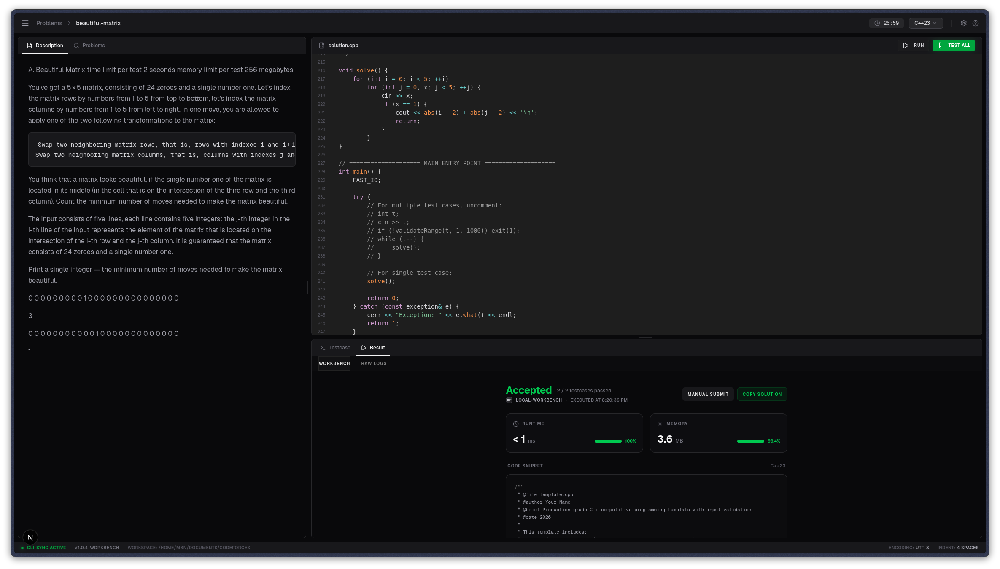

<div align="center">

# cf Toolkit

**The Ultimate C++ Competitive Programming Workbench**

[](LICENSE)
[](https://en.cppreference.com/w/cpp/23)
[](https://nextjs.org/)
[](https://tailwindcss.com/)
[](README.md)

[**Explore Features**](#-key-features) • [**Web Workbench**](#-new-web-workbench) • [**Installation**](#-installation) • [**Quick Start**](#-quick-start)

</div>

---

## About

`cf` is a high-performance toolkit designed to eliminate the boilerplate and friction of competitive programming. Whether you're a Codeforces veteran or just starting out, `cf` provides the tools you need to solve, test, and debug problems with lightning speed.

> [!NOTE]
> With a powerful **Bash CLI** and a brand-new **Next.js Web Workbench**, you can manage your entire workflow from the terminal or a beautiful, responsive UI. They stay perfectly in sync.

---

## Key Features

- **Optimized C++ Templates:** Start every problem with a battle-tested `template.cpp` featuring fast I/O and essential utilities.
- **Automated Problem Setup:** Generate a full workspace (solution + sample cases) for any problem with a single command.
- **Smart Test Runner:** Automatically parse example cases and compare your output against expected results.
- **Safety First:** Built-in protection against infinite loops (timeouts), integer overflows, and runtime errors.
- **Algorithm Library:** Dedicated `templates/` folder to store and reuse your DP, Graph, and Math snippets.
- **CLI-Web Sync:** Use the CLI for setup and the Web Workbench for interactive coding—they stay perfectly in sync.

---

## New: Web Workbench

The `cf` Web Workbench brings a modern IDE experience to your local problem-solving.

<div align="center">
  
  <p><i>A beautiful, responsive workspace for deep focus.</i></p>
</div>

### Features of the Web UI:
- **Split-Pane Design:** View problem statements, code, and results side-by-side.
- **Modern Code Editor:** C++ syntax highlighting with line numbers and indent guides.
- **Interactive Results:** Visual feedback on "Accepted", "Wrong Answer", and "Runtime Error".
- **Real-time Statistics:** Track execution time and memory usage for every run.
- **Sample Management:** Easily toggle between multiple sample cases or inject custom input.
- **Integrated Timer:** Keep track of your solving time just like in a real contest.

---

## Advanced CLI Usage

The `cf` command is a Swiss Army Knife for the terminal:

| Command | Description |
| ------- | ----------- |
| `cf template <name>` | Scaffolds a new problem directory with solution and samples. |
| `cf serve [name]` | Launches the Web Workbench (optionally starts a new problem). |
| `cf` | Automatically detects `problem.txt`, compiles, and runs against sample #1. |
| `cf -s 2` | Runs your solution against sample #2 from the problem statement. |
| `cf "5\n1 2 3"` | Runs your solution with inline input. |
| `cf test` | Runs ALL sample cases and provides a detailed summary + diffs. |
| `cf update` | Pulls the latest toolkit changes and re-runs setup. |

### Build Caching
> [!TIP]
> `cf` automatically hashes your source files and compiler flags. If nothing has changed, it skips compilation and runs the cached binary instantly—saving you precious seconds during contests!

---

## Tech Stack

- **Core:** Bash 4.0+, GNU Make
- **Frontend:** Next.js 15 (App Router), React 19, TypeScript
- **Styling:** Tailwind CSS 4, Shadcn UI, Lucide Icons
- **C++:** C++23 (standard), g++/clang++

---

## Installation

### Quick Setup

```bash
# Clone the repository
git clone https://github.com/mbn-code/cf.git
cd cf

# Run the installer (installs dependencies and configures PATH)
bash scripts/setup.sh
```

> [!IMPORTANT]
> Ensure you have a modern C++ compiler (`g++-14` or `clang++-15`), `make`, and `node` (for the Web UI).

---

## Quick Start

### 1. Initialize a Problem
```bash
cf template 123A
cd 123A
```

> [!TIP]
> Use `<kbd>cd</kbd>` into the problem directory to enable automatic `problem.txt` detection for the `cf` command.

### 2. Solve & Test (CLI)
Edit `solution.cpp`, then run:
```bash
cf      # Run against sample cases
cf test # Run full test suite
```

### 3. Launch Web Workbench
```bash
cd web
npm install && npm run dev
```
Open [http://localhost:3000](http://localhost:3000) in your browser.

> [!CAUTION]
> The Web Workbench runs a local development server. Ensure you only run it in trusted environments as it has access to your local filesystem to read/write solutions.

---

## Repository Structure

<details>
<summary>Click to expand folder details</summary>

```text
cf/
├── scripts/       # CLI Tools (cf, setup, test)
├── web/           # Next.js Web Workbench
├── src/           # Problem solutions (workspace)
├── templates/     # Reusable algorithm snippets
├── include/       # Shared C++ headers
├── docs/          # Detailed documentation
└── tests/         # Toolkit self-tests
```

</details>

---

## Contributing

Contributions are welcome! See [CONTRIBUTING.md](CONTRIBUTING.md) for details on how to get started.

## License

This project is licensed under the MIT License - see the [LICENSE](LICENSE) file for details.

---

<div align="center">
  Built with for the Competitive Programming Community.
</div>
